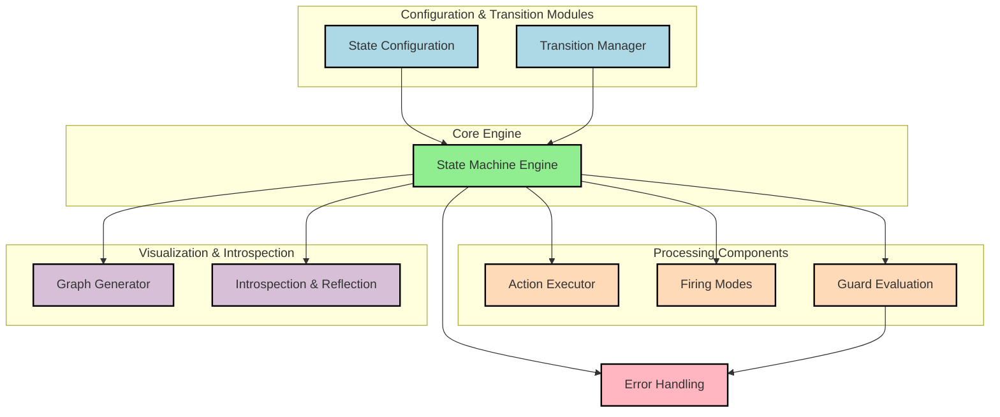

# Stateless-py

[](https://github.com/alti3/stateless-py/actions/workflows/python-ci.yml)
[](https://badge.fury.io/py/stateless-py) <!-- TODO: Update when published -->
[](https://opensource.org/licenses/Apache-2.0)

`stateless-py` is a versatile and straightforward library for creating state machines in Python, heavily inspired by the popular [Stateless](https://github.com/dotnet-state-machine/stateless) library for C#. It allows you to define states and triggers, configure transitions with guards and actions, manage state hierarchies (substates), and introspect the machine's structure.

## Features

*   **Fluent Configuration API:** Define state machine behaviour easily (`configure`, `permit`, `on_entry`, etc.).
*   **Generic States and Triggers:** Use enums, strings, integers, or any hashable type.
*   **Entry/Exit Actions:** Execute code when entering or leaving states (`on_entry`, `on_exit`).
*   **Activate/Deactivate Actions:** Hook into the lifecycle of states within hierarchies (`on_activate`, `on_deactivate`).
*   **Guard Clauses:** Control transitions based on conditions (`permit_if`, `ignore_if`, etc.).
*   **Parameterized Triggers:** Pass data along with triggers when calling `fire` or `fire_async`.
*   **Reentry and Internal Transitions:** Handle transitions within the same state (`permit_reentry`, `internal_transition`).
*   **Substates:** Model hierarchical state machines (`substate_of`, `initial_transition`).
*   **Async Support:** Define and use `async` actions and guards seamlessly with `fire_async`.
*   **Introspection:** Get a detailed structure of the machine (`get_info()`) using Pydantic models.
*   **Graph Generation:** Visualize the state machine in DOT or Mermaid formats (`generate_dot_graph()`, `generate_mermaid_graph()`, `visualize()`).

## Architecture Overview

The library is structured into several key components, as shown in the diagram below. Click on a component to navigate to its source code. (The source diagram can be found in `docs/architecture.mmd`).



## Installation

```bash
pip install stateless-py
or
uv add stateless-py
```

*(Note: The package is not yet published to PyPI. For development, install locally.)*

```bash
# Clone the repository
git clone https://github.com/alti3/stateless-py.git # TODO: Replace with your repo URL
cd stateless-py

# Install in editable mode with development dependencies
pip install -e ".[dev]"
```

## Basic Usage

Here's a simple example of an on/off switch:

```python
# examples/on_off.py (Conceptual)
from enum import Enum, auto
from stateless import StateMachine

# 1. Define States and Triggers (using Enums recommended)
class SwitchState(Enum):
    ON = auto()
    OFF = auto()

class SwitchTrigger(Enum):
    TOGGLE = auto()

# 2. Create the State Machine instance
sm = StateMachine[SwitchState, SwitchTrigger](SwitchState.OFF) # Start in OFF state

# 3. Configure the transitions
sm.configure(SwitchState.OFF).permit(SwitchTrigger.TOGGLE, SwitchState.ON)
sm.configure(SwitchState.ON).permit(SwitchTrigger.TOGGLE, SwitchState.OFF)

# 4. Interact with the machine
print(f"Initial state: {sm.state}") # Output: Initial state: SwitchState.OFF

sm.fire(SwitchTrigger.TOGGLE)
print(f"After toggle: {sm.state}") # Output: After toggle: SwitchState.ON

sm.fire(SwitchTrigger.TOGGLE)
print(f"After second toggle: {sm.state}") # Output: After second toggle: SwitchState.OFF

# Check permitted triggers (assuming implementation exists)
# permitted = sm.get_permitted_triggers()
# print(f"Permitted triggers in state {sm.state}: {permitted}")

# Check if a trigger can be fired (assuming implementation exists)
# can_toggle = sm.can_fire(SwitchTrigger.TOGGLE)
# print(f"Can fire TOGGLE? {can_toggle}")
```

## Advanced Usage (Conceptual Examples)

### Guards

Use `permit_if` to add conditions to transitions:

```python
from stateless import StateMachine, InvalidTransitionError # Assuming GuardConditionFailedError maps to InvalidTransitionError or similar
# ... (States and Triggers defined) ...
is_authorized = False

sm = StateMachine[State, Trigger](State.Locked)

# Guard function returning boolean
def check_auth():
    return is_authorized

sm.configure(State.Locked).permit_if(Trigger.Unlock, State.Unlocked, check_auth, "User must be authorized")
sm.configure(State.Unlocked).permit(Trigger.Lock, State.Locked)

# Try to unlock without authorization
try:
    sm.fire(Trigger.Unlock)
except InvalidTransitionError as e:
    # Error message might detail unmet guards if implemented
    print(f"Failed: {e}")

# Authorize and try again
is_authorized = True
sm.fire(Trigger.Unlock)
print(f"State after authorized unlock: {sm.state}") # Output: State after authorized unlock: State.Unlocked
```

### Entry/Exit Actions

Execute functions when entering or leaving states:

```python
# ... (States and Triggers defined) ...

def entering_state_b(transition):
    print(f"Entering State B from {transition.source} via {transition.trigger}")

def exiting_state_a(transition):
    print(f"Exiting State A towards {transition.destination} via {transition.trigger}")

sm = StateMachine[State, Trigger](State.A)

sm.configure(State.A).permit(Trigger.X, State.B).on_exit(exiting_state_a)
sm.configure(State.B).on_entry(entering_state_b)

sm.fire(Trigger.X)
# Output:
# Exiting State A towards State.B via Trigger.X
# Entering State B from State.A via Trigger.X
```

### Parameterized Triggers

Pass data with triggers by providing arguments to `fire` or `fire_async`. Actions/Guards can accept these arguments.

```python
# ... (States defined) ...
class Trigger(Enum):
    ASSIGN = auto()

sm = StateMachine[State, Trigger](State.Idle)

# Action accepts parameters matching those passed to fire()
# The 'transition' object is also available if the action accepts it
def assign_task(user_id: int, task: str, transition):
    print(f"Assigning task '{task}' to user {user_id} (triggered by {transition.trigger})")

sm.configure(State.Idle).permit(Trigger.ASSIGN, State.Assigned)
# Use on_entry_from to make action specific to the trigger
sm.configure(State.Assigned).on_entry_from(Trigger.ASSIGN, assign_task)

# Pass parameters when firing the trigger
sm.fire(Trigger.ASSIGN, 123, "Implement feature Y")
# Output: Assigning task 'Implement feature Y' to user 123 (triggered by Trigger.ASSIGN)
print(f"State: {sm.state}") # Output: State: State.Assigned
```

### Async Operations

Use `async def` for guards and actions, and `fire_async`:

```python
import asyncio
# ... (States and Triggers defined) ...

async def async_guard() -> bool:
    await asyncio.sleep(0.01) # Simulate async check
    print("Async guard checked")
    return True

async def async_entry_action(transition):
    await asyncio.sleep(0.01) # Simulate async work
    print(f"Async entry action executed for {transition.destination}")

sm = StateMachine[State, Trigger](State.A)

# Use permit_if with an async guard (or a dedicated permit_if_async if added)
sm.configure(State.A).permit_if(Trigger.X, State.B, async_guard)
# Use on_entry with an async action (or a dedicated on_entry_async if added)
sm.configure(State.B).on_entry(async_entry_action)

async def main():
    # Use fire_async when async guards/actions might be involved
    await sm.fire_async(Trigger.X)
    print(f"Final state: {sm.state}")

asyncio.run(main())
# Output:
# Async guard checked
# Async entry action executed for State.B
# Final state: State.B
```

### Substates

Define state hierarchies using `substate_of`:

```python
from enum import Enum # Make sure Enum is imported

class ParentState(Enum): A = auto(); B = auto()
class ChildStateA(Enum): A1 = auto(); A2 = auto()
class Trigger(Enum): X = auto(); Y = auto(); Z = auto()

# Use a common base type if mixing enums, or Any
sm = StateMachine[Enum, Trigger](ChildStateA.A1)

sm.configure(ChildStateA.A1).substate_of(ParentState.A).permit(Trigger.X, ChildStateA.A2)
sm.configure(ChildStateA.A2).substate_of(ParentState.A).permit(Trigger.Y, ParentState.B)
sm.configure(ParentState.B).permit(Trigger.Z, ChildStateA.A1)

# Add actions/guards to parent states
sm.configure(ParentState.A).on_entry(lambda t: print(f"Entering Parent A scope (to {t.destination})"))
sm.configure(ParentState.A).on_exit(lambda t: print(f"Exiting Parent A scope (from {t.source})"))

print(f"State: {sm.state}") # State: ChildStateA.A1
# Use is_in_state to check hierarchy (assuming implementation exists)
# print(f"Is in Parent A? {sm.is_in_state(ParentState.A)}")

sm.fire(Trigger.X) # Stays within Parent A
print(f"State: {sm.state}") # State: ChildStateA.A2
# print(f"Is in Parent A? {sm.is_in_state(ParentState.A)}")

sm.fire(Trigger.Y) # Moves from Child A2 to Parent B
# Output (Expected):
# Exiting Parent A scope (from ChildStateA.A2)
print(f"State: {sm.state}") # State: ParentState.B
# print(f"Is in Parent A? {sm.is_in_state(ParentState.A)}")
```

## Introspection and Visualization

You can inspect the machine's configuration and generate diagrams.

### Get Machine Info

```python
# Assuming sm is configured
info = sm.get_info() # Returns a StateMachineInfo pydantic model

print(f"Initial State: {info.initial_state}")
for state_info in info.states:
    print(f"State: {state_info.underlying_state}")
    # Access transitions, entry_actions, exit_actions, substates, superstate etc.
    for t in state_info.fixed_transitions:
        print(f"  -> Trigger: {t.trigger.underlying_trigger}, Dest: {t.destination_state}, Guards: {len(t.guard_conditions)}")
    for i in state_info.ignored_triggers:
         print(f"  -| Ignore Trigger: {i.trigger.underlying_trigger}, Guards: {len(i.guard_conditions)}")
```

### Generate DOT Graph (for Graphviz)

```python
# Requires 'graphviz' optional dependency: pip install stateless-py[graphing]
# Also requires Graphviz executable installed system-wide.

dot_graph = sm.generate_dot_graph()
print(dot_graph)

# Option 1: Save to file and render manually
# with open("state_machine.gv", "w") as f:
#     f.write(dot_graph)
# # Then run: dot -Tpng state_machine.gv -o state_machine.png

# Option 2: Use the visualize helper (attempts to render and open)
try:
    sm.visualize(filename="my_machine.gv", format="png", view=True)
except Exception as e:
    print(f"Could not visualize graph: {e}")

```

### Generate Mermaid Graph (for Markdown/Web)

```python
mermaid_graph = sm.generate_mermaid_graph() # direction="LR" can be added if implemented
print(mermaid_graph)

# Paste into Markdown supporting Mermaid:
# ```mermaid
# stateDiagram-v2
#     [*] --> OFF
#     OFF --> ON : TOGGLE
#     ON --> OFF : TOGGLE
# ```
# (Actual output will depend on machine configuration)
```

# Parity with origical C#/dotnet package
This is a comparison table outlining the features of the C# `Stateless` library and their implementation status in the Python port `stateless-py`.

| Feature (C#)                                       | Implemented in Python Port? | Notes                                                                                                                                  |
| :------------------------------------------------- | :-------------------------- | :------------------------------------------------------------------------------------------------------------------------------------- |
| **Core Functionality**                             |                             |                                                                                                                                        |
| Generic States (`TState`)                          | Yes                         | Python uses `typing.TypeVar` and generics (`StateMachine[StateT, TriggerT]`).                                                            |
| Generic Triggers (`TTrigger`)                      | Yes                         | Python uses `typing.TypeVar` and generics (`StateMachine[StateT, TriggerT]`).                                                            |
| State Machine Instantiation                        | Yes                         | `StateMachine(initial_state)`                                                                                                          |
| Fluent Configuration API (`Configure`)             | Yes                         | `sm.configure(state)` returns a `StateConfiguration` object.                                                                            |
| Basic Transitions (`Permit`)                       | Yes                         | `permit(trigger, destination_state)`                                                                                                     |
| External State Storage (`stateAccessor/Mutator`)   | Yes                         | Python constructor accepts `state_accessor` and `state_mutator` callables.                                                               |
| **State Actions**                                  |                             |                                                                                                                                        |
| Entry Actions (`OnEntry`)                          | Yes                         | `on_entry(action)`                                                                                                                     |
| Entry Actions from Trigger (`OnEntryFrom`)         | Yes                         | `on_entry_from(trigger, action)`                                                                                                       |
| Exit Actions (`OnExit`)                            | Yes                         | `on_exit(action)`                                                                                                                      |
| Activation Actions (`OnActivate`)                  | Yes                         | `on_activate(action)`                                                                                                                  |
| Deactivation Actions (`OnDeactivate`)              | Yes                         | `on_deactivate(action)`                                                                                                                |
| **Transition Control**                             |                             |                                                                                                                                        |
| Guard Clauses (`PermitIf`)                         | Yes                         | `permit_if(trigger, dest, guard)`, `ignore_if`, `permit_reentry_if`, `internal_transition` with `guard`. Guards can be sync or async. |
| Ignored Triggers (`Ignore`, `IgnoreIf`)            | Yes                         | `ignore(trigger)`, `ignore_if(trigger, guard)`                                                                                         |
| Reentrant States (`PermitReentry`, `PermitReentryIf`) | Yes                         | `permit_reentry(trigger)`, `permit_reentry_if(trigger, guard)`                                                                         |
| Internal Transitions (`InternalTransition`)        | Yes                         | `internal_transition(trigger, action, guard)`                                                                                          |
| Dynamic Transitions (`PermitDynamic`, `PermitDynamicIf`) | Yes                         | `dynamic(trigger, selector, guard)`                                                                                                    |
| **Hierarchy (Substates)**                          |                             |                                                                                                                                        |
| Substates (`SubstateOf`)                           | Yes                         | `substate_of(superstate)`                                                                                                              |
| Superstate Trigger Handling                        | Yes                         | Triggers not handled in a substate bubble up to superstates.                                                                             |
| Hierarchical Action Execution (Entry/Exit order)   | Yes                         | Python's `StateRepresentation.enter/exit` implement hierarchical execution.                                                              |
| `IsInState` Check                                  | Yes                         | `is_in_state(state)` checks current state and superstates.                                                                               |
| Initial Transitions (`InitialTransition`)            | Yes                         | `initial_transition(target_state)` on the superstate's configuration.                                                                  |
| **Triggers & Parameters**                          |                             |                                                                                                                                        |
| Parameterized Triggers (`SetTriggerParameters`)      | Yes                         | `set_trigger_parameters(trigger, *param_types)` for introspection. Actual params passed via `fire()` args.                               |
| Parameterized Actions/Guards                       | Yes                         | Actions/guards can accept parameters passed during `fire()` (via `*args` or named parameters).                                           |
| Typed Trigger Classes (`TriggerWithParameters<T>`) | No                          | Python passes parameters directly via `fire(*args)` rather than using specific trigger wrapper classes.                                    |
| **Asynchronous Operations**                        |                             |                                                                                                                                        |
| Async Actions (`OnEntryAsync`, etc.)               | Yes                         | Python uses `async def` for actions/guards and configures them with the standard methods (`on_entry`, `permit_if`, etc.).                |
| Async Firing (`FireAsync`)                         | Yes                         | `fire_async(trigger, *args)`                                                                                                           |
| Async Guards                                       | Yes                         | `async def` functions can be used as guards with `permit_if` etc. when using `fire_async`.                                                |
| Async Dynamic Destination Selector                 | Yes                         | The selector function passed to `dynamic()` can be an `async def` function.                                                                |
| **Introspection & Visualization**                  |                             |                                                                                                                                        |
| Get Machine Info (`GetInfo`)                       | Yes                         | `get_info()` returns a `StateMachineInfo` Pydantic model.                                                                                |
| Reflection API (`StateMachineInfo`, etc.)        | Yes                         | Python uses Pydantic models in `reflection.py` for a similar purpose.                                                                    |
| Export to DOT Graph (`UmlDotGraph.Format`)         | Yes                         | `generate_dot_graph()` produces DOT format.                                                                                              |
| Visualize Graph (`graphviz` integration)           | Yes                         | `visualize()` helper function (requires `graphviz` library and executable).                                                              |
| Export to Mermaid Graph (`MermaidGraph.Format`)    | Yes                         | `generate_mermaid_graph()` produces Mermaid format.                                                                                      |
| **Advanced Features**                              |                             |                                                                                                                                        |
| Unhandled Trigger Handler (`OnUnhandledTrigger`)   | Yes                         | `on_unhandled_trigger(handler)`, `on_unhandled_trigger_async(handler)`                                                                   |
| Transition Events (`OnTransitioned`)               | Partial                     | Python has an `on_transitioned_callback` parameter in the `StateMachine` constructor. C# also has `OnTransitionCompleted`.                |
| Transition Completed Event (`OnTransitionCompleted`) | No                          | No direct equivalent found in the provided Python code.                                                                                  |
| Firing Modes (`FiringMode.Immediate`, `Queued`)    | Yes                         | `FiringMode` enum and `firing_mode` constructor parameter exist. Queue processing logic is present for `QUEUED`.                       |
| `RetainSynchronizationContext`                     | No                          | Specific to .NET `SynchronizationContext`, not applicable to Python `asyncio`.                                                             |

## Development

1.  Clone the repository.
2.  Create a virtual environment: `python -m venv .venv`
3.  Activate it: `source .venv/bin/activate` (or `.\.venv\Scripts\activate` on Windows)
4.  Install dependencies: `pip install -e ".[dev]"`
5.  Run tests: `pytest`
6.  Run linters/formatters: `ruff check . && ruff format .` (or use `pre-commit install`)

## Contributing

Contributions are welcome! Please open an issue or submit a pull request.

You can report bugs or suggest features via [GitHub Issues](https://github.com/alti3/stateless-py/issues).

## License

This project is licensed under the Apache License 2.0 - see the [LICENSE](LICENSE) file for details. 