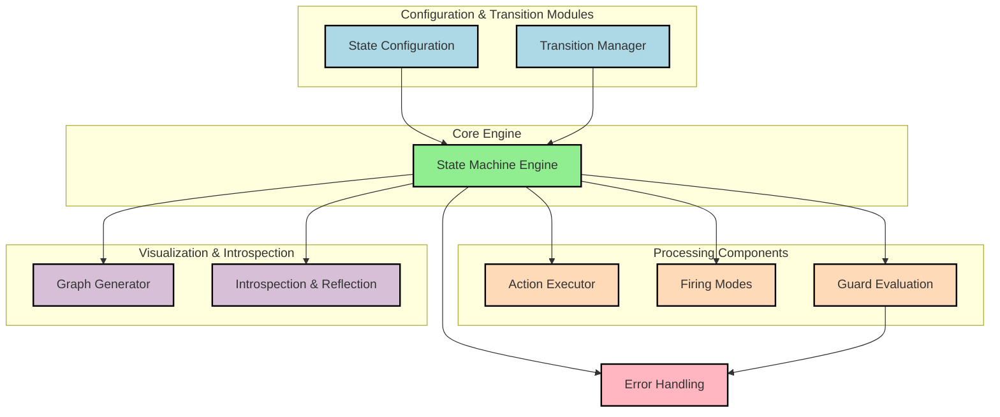

# Architecture

The diagram below shows major modules and interactions.

## Module Roles

- `state_machine.py`: orchestration engine and firing logic
- `state_configuration.py`: fluent API for machine configuration
- `state_representation.py`: internal per-state behavior store
- `trigger_behaviour.py`: behavior implementations (fixed, ignored, reentry, internal, dynamic)
- `actions.py`: action wrappers/factories for sync/async execution
- `guards.py`: guard evaluation logic
- `reflection.py`: introspection schema models
- `graph.py`: DOT/Mermaid generation and Graphviz render helper
